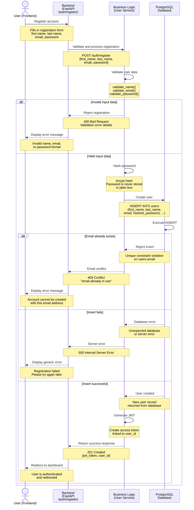
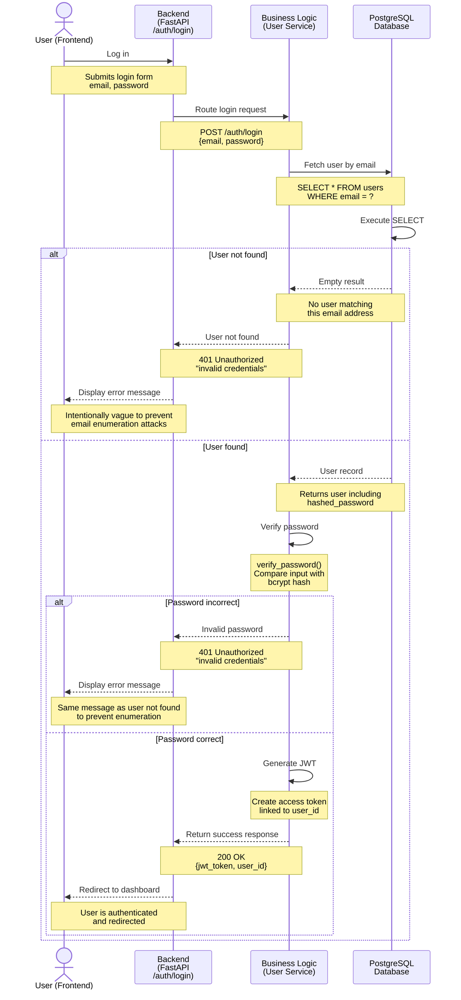

# CinéMood - High-Level Sequence Diagrams

This document illustrates the key interaction flows of the CinéMood application.
Each diagram shows how the system components communicate step by step for a given use case.

---

## 1. User Registration:

This sequence covers the full flow when a new user creates an account on CinéMood.

**Actors:**
- `User` - the React Frontend
- `Backend` - the `/auth/register` route of the `FastAPI`
- `Buisiness Logic` - the  User Service of the `FastAPI`
- `Database` - the PostgreSQL database

**Key steps:**
1. The user submits the registration form via the frontend
2. The frontend sends a POST request to /auth/register
3. The backend routes the request to the User Service
4. The User Service validates the input data (name, email, password format)
5. The User Service hashes the password using bcrypt
6. The User Service inserts the new user record into the database
7. If the email already exists, a 409 Conflict is returned
8. If the insert fails, a 500 Internal Server Error is returned
9. If successful, a JWT token is generated and returned with a 201 Created response
10. The frontend redirects the authenticated user to the dashboard

---

## 2. User Login

This sequence covers the flow when a returning user logs into their account.

**Actors:**
`User` - the React Frontend
`Backend` - the `/auth/login` route of the `FastAPI`
`Business` Logic - the User Service of the `FastAPI`
`Database` - the PostgreSQL database

**Key steps:**
1. The user submits their email and password via the frontend
2. The frontend sends a POST request to /auth/login
3. The backend routes the request to the User Service
4. The User Service queries the database for the user by email
5. If the user is not found, a 401 Unauthorized is returned
6. The User Service verifies the password against the stored bcrypt hash
7. If the password is incorrect, a 401 Unauthorized is returned
8. If valid, a JWT token is generated and returned with a 200 OK response
9. The frontend stores the token and redirects to the dashboard

