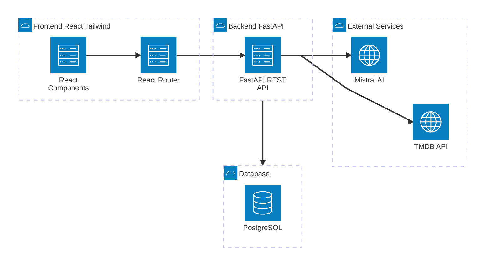
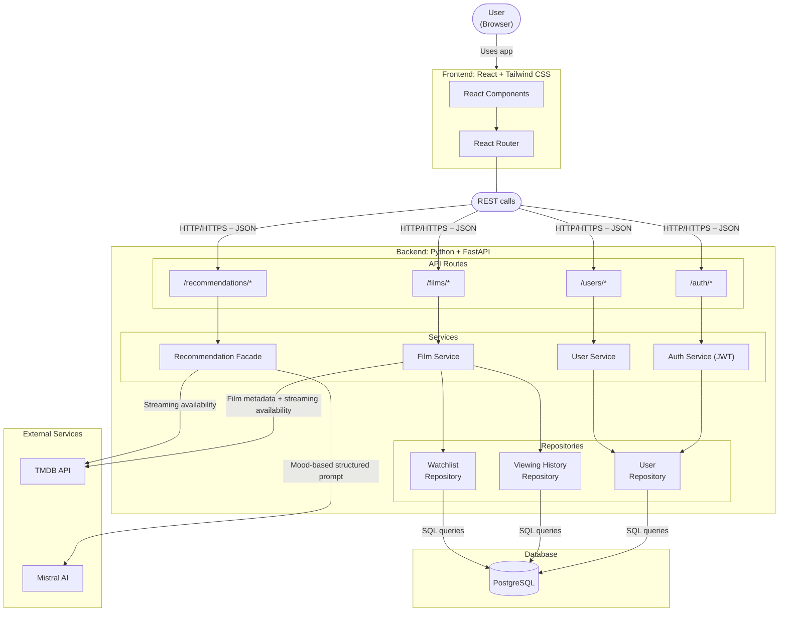
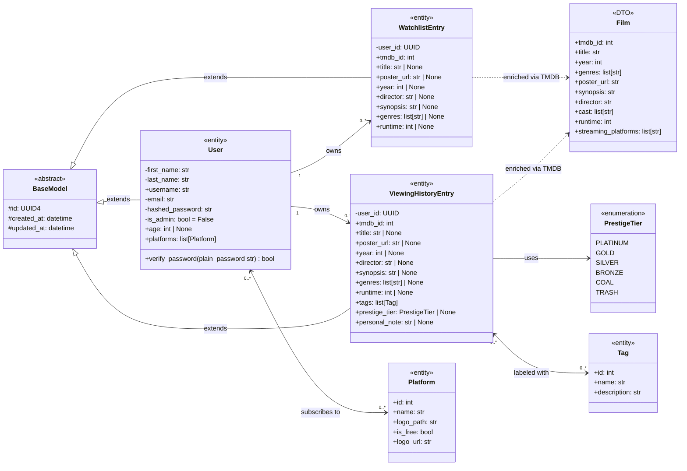
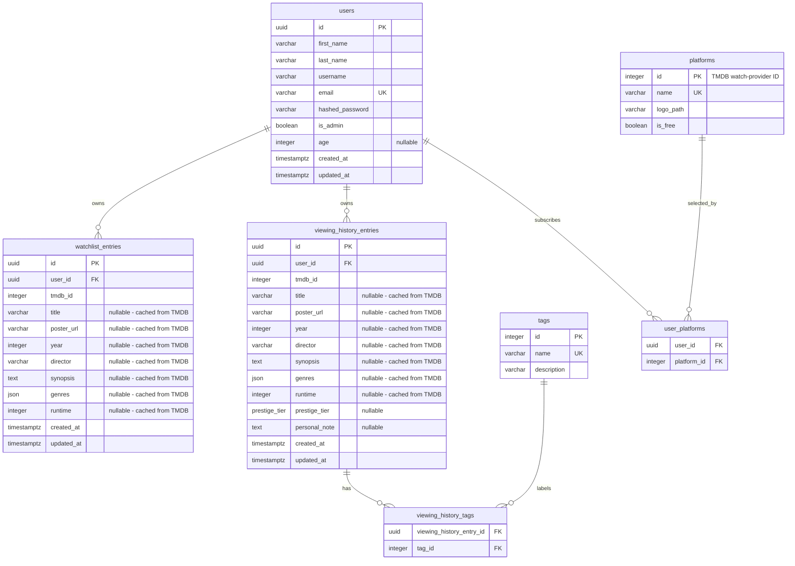

# 🎬 CinéMood - Application Diagrams

This document is the single reference for all CinéMood architectural and data diagrams.
It consolidates the system architecture, class structure, and database schema, updated to reflect the final implementation after the MVP development phase.

---

## Table of Contents

- [1. System Architecture](#system-architecture)
  - [1.1. High-Level Overview](#high-level-overview)
  - [1.2. Detailed Component Architecture](#detailed-component-architecture)
  - [1.3. Design Patterns](#design-patterns)
- [2. Class Diagram](#class-diagram)
  - [2.1. Design Conventions](#design-conventions)
  - [2.2. Class Descriptions](#class-descriptions)
  - [2.3. Class Diagram](#class-diagram-1)
  - [2.4. Relationship Summary](#relationship-summary)
  - [2.5. Design Decisions](#design-decisions)
- [3. Entity Relationship Diagram](#entity-relationship-diagram)
  - [3.1. ER Diagram](#er-diagram)
  - [3.2. Glossary](#glossary)
  - [3.3. Relationship Summary](#relationship-summary-1)
  - [3.4. Design Notes](#design-notes)
- [4. Changes from Initial Design to Final Implementation](#changes-from-initial-design-to-final-implementation)
- [5. Author](#author)

---

## System Architecture

This section describes how the four main layers of CinéMood communicate: the React frontend, the FastAPI backend, the PostgreSQL database, and the two external services (TMDB API and Mistral AI).

---

### High-Level Overview

This diagram shows the four main components of the system and how they communicate.

#### Component Interactions

| From | To | Description |
|---|---|---|
| React Components | React Router | User actions trigger client-side navigation |
| React Router | FastAPI REST API | HTTP/HTTPS requests with JSON payloads |
| FastAPI REST API | PostgreSQL | SQL queries for all persistent data (users, watchlist, history, tags, platforms) |
| FastAPI REST API | TMDB API | Fetches film metadata (title, poster, synopsis, cast, streaming availability) and resolves AI suggestions |
| FastAPI REST API | Mistral AI | Sends mood context and viewing history as a structured prompt, receives film recommendations in JSON |

---

### Detailed Component Architecture

This diagram zooms into the internal structure of the backend, showing the API routes, services, repositories, and their connections to the database and external services.

#### Component Interactions

| From | To | Description |
|---|---|---|
| User | React Components | The user interacts with the app through the browser |
| React Components | React Router | Navigation between pages is handled client-side without full page reloads |
| React Router | API Routes | All backend communication goes through HTTP/HTTPS calls with JSON payloads |
| /auth/* | Auth Service | Handles registration, login, and JWT token generation and validation |
| /films/* | Film Service | Handles film search, logging, tagging, and watchlist management |
| /users/* | User Service | Handles user profile and streaming platform preferences |
| /recommendations/* | Recommendation Facade | Orchestrates the full recommendation flow (mood questionnaire + swipe deck + LLM) |
| Auth Service | User Repository | Reads and writes user authentication data |
| Film Service | Viewing History Repository | Reads and writes film logging, tag, and prestige tier data |
| Film Service | Watchlist Repository | Reads and writes watchlist entries |
| Film Service | TMDB API | Fetches and caches film metadata (poster, synopsis, director, genres, runtime) and streaming availability at save time |
| Recommendation Facade | TMDB API | Resolves Mistral title+year suggestions to real TMDB IDs; fetches streaming availability for recommended films |
| Recommendation Facade | Mistral AI | Sends a structured prompt with mood, age, viewing history, and watchlist context; receives film suggestions and match scores in JSON |
| All Repositories | PostgreSQL | All persistent data is stored and retrieved via SQL queries |

---

### Design Patterns

| Pattern | Where applied | Reason |
|---|---|---|
| **Repository** | Data access layer | Isolates all database queries from business logic. Each entity (User, Viewing History, Watchlist) has its own repository, making the code easier to maintain and test. |
| **Facade** | Recommendation Service | Hides the complexity of orchestrating user context, TMDB resolution, and Mistral AI behind a single clean interface. The route calls one method - the facade handles everything else. |
| **DTO (Data Transfer Object)** | Film class | Film metadata is never stored as a standalone entity. A lightweight DTO is populated on demand from TMDB and passed between layers, avoiding a permanent local film table. |
| **REST** | API design | Standard architectural style for web APIs - stateless, resource-based, JSON responses. Consumed by the React frontend. |

---

## Class Diagram

This section describes the class structure of the CinéMood backend business logic layer.
It covers all persistent entities, data transfer objects, and enumerations used in the application.

---

### Design Conventions

#### Visibility Modifiers (UML)

| Symbol | Meaning | Usage in CinéMood |
|---|---|---|
| `+` | Public | Methods and attributes accessible from outside the class |
| `-` | Private | Sensitive data or internal logic, not accessible from outside |
| `#` | Protected | Attributes inherited from BaseModel, accessible in subclasses only |

> *Note: Python does not enforce visibility at runtime. These modifiers reflect design intent and are used here to communicate architectural decisions clearly.*

#### Stereotypes

| Stereotype | Meaning |
|---|---|
| `<<abstract>>` | Base class - never instantiated directly, only inherited |
| `<<entity>>` | Persistent class - stored in the PostgreSQL database |
| `<<DTO>>` | Data Transfer Object - temporary object, never stored in DB |
| `<<enumeration>>` | Fixed list of allowed values |

---

### Class Descriptions

---

#### BaseModel

**`<<abstract>>`**

The abstract base class inherited by all persistent SQLAlchemy models (User, WatchlistEntry, ViewingHistoryEntry).
It centralises the three attributes shared by every entity, avoiding duplication across the codebase.

**Attributes**

| Visibility | Name | Type | Description |
|---|---|---|---|
| `#` | `id` | UUID4 | Primary key, generated automatically by Python via `uuid4()`. Never modified after creation. |
| `#` | `created_at` | datetime | Timestamp set by PostgreSQL at insertion. Never modified after creation. |
| `#` | `updated_at` | datetime | Timestamp set by PostgreSQL at insertion, refreshed automatically on every update. |

> *Note: `__abstract__ = True` prevents SQLAlchemy from creating a table for this class. Only its subclasses have database tables.*

---

#### User

**`<<entity>>`**

Represents a registered user of CinéMood. Handles authentication, profile data, and access to personal content (viewing history, watchlist, platform preferences).

**Attributes**

| Visibility | Name | Type | Default | Description |
|---|---|---|---|---|
| `-` | `first_name` | str | - | Stored separately from last name for flexible display. Maximum 60 characters. |
| `-` | `last_name` | str | - | Stored separately from first name. Maximum 60 characters. |
| `+` | `username` | str | - | Display name generated from `first_name + last_name` at registration. Stored independently to support future modification. Maximum 120 characters. |
| `-` | `email` | str | - | Unique login identifier. Validated for format and uniqueness at the database level. Maximum 255 characters. |
| `-` | `hashed_password` | str | - | The password is never stored in plain text. Hashed using bcrypt before storage. |
| `-` | `is_admin` | bool | False | Administrative flag. Reserved for future admin features. |
| `+` | `age` | int \| None | None | Optional. Used by the Recommendation Facade to contextualise film suggestions. |
| `+` | `platforms` | list[Platform] | - | Streaming platforms selected by the user. Loaded eagerly (`lazy="joined"`) so they are always available alongside the User without an extra query. |

**Methods**

| Visibility | Name | Return type | Description |
|---|---|---|---|
| `+` | `verify_password(plain_password: str)` | bool | Compares a plain-text input against the stored bcrypt hash. Returns True if valid. Used at login. |

---

#### Film

**`<<DTO>>`**

A Data Transfer Object used to carry film metadata between layers of the application. **Never saved to the database.**

Film is populated from the TMDB API response and used for enriched display (search results, film detail pages, recommendation cards). Watchlist and history entries cache a subset of these fields locally at save time to avoid repeated API calls on list loads.

**Attributes**

| Visibility | Name | Type | Description |
|---|---|---|---|
| `+` | `tmdb_id` | int | TMDB unique identifier. |
| `+` | `title` | str | Film title (English, en-US for the MVP). |
| `+` | `year` | int | Release year. |
| `+` | `genres` | list[str] | List of genre labels as returned by TMDB. |
| `+` | `poster_url` | str | Full URL to the film poster image on TMDB's CDN. |
| `+` | `synopsis` | str | Short plot description. |
| `+` | `director` | str | Director name, extracted from TMDB crew data. |
| `+` | `cast` | list[str] | Top 5 billed cast members. |
| `+` | `runtime` | int | Film duration in minutes. |
| `+` | `streaming_platforms` | list[str] | Platforms where the film is currently available (subscription only, filtered by country). |

*Film has no methods - it is a passive data container.*

---

#### WatchlistEntry

**`<<entity>>`**

Represents a single film saved to a user's watchlist. A core subset of film metadata is cached at save time to avoid calling TMDB on every watchlist load.

**Attributes**

| Visibility | Name | Type | Description |
|---|---|---|---|
| `-` | `user_id` | UUID | Foreign key linking the entry to its owner. |
| `+` | `tmdb_id` | int | TMDB identifier of the film. |
| `+` | `title` | str \| None | Film title cached at save time. |
| `+` | `poster_url` | str \| None | Full poster URL cached at save time. |
| `+` | `year` | int \| None | Release year cached at save time. |
| `+` | `director` | str \| None | Director name cached at save time. |
| `+` | `synopsis` | str \| None | Film overview cached at save time. |
| `+` | `genres` | list[str] \| None | Genre list cached at save time as JSON. |
| `+` | `runtime` | int \| None | Duration in minutes cached at save time. |

> *A `(user_id, tmdb_id)` unique constraint prevents the same film from appearing twice in a user's watchlist.*

---

#### ViewingHistoryEntry

**`<<entity>>`**

Represents a single film that a user has watched and rated. Stores the user's personal experience through tags, a prestige tier rating, and an optional note. Film metadata is cached locally at log time.

> *Note: the creation date of this entry (inherited as `created_at` from BaseModel) serves as the watch date. No separate `watched_at` field is needed.*

**Attributes**

| Visibility | Name | Type | Description |
|---|---|---|---|
| `-` | `user_id` | UUID | Foreign key linking the entry to its owner. |
| `+` | `tmdb_id` | int | TMDB identifier of the film. |
| `+` | `title` | str \| None | Film title cached at log time. |
| `+` | `poster_url` | str \| None | Full poster URL cached at log time. |
| `+` | `year` | int \| None | Release year cached at log time. |
| `+` | `director` | str \| None | Director name cached at log time. |
| `+` | `synopsis` | str \| None | Film overview cached at log time. |
| `+` | `genres` | list[str] \| None | Genre list cached at log time as JSON. |
| `+` | `runtime` | int \| None | Duration in minutes cached at log time. |
| `+` | `tags` | list[Tag] | Mood and quality labels chosen by the user. Loaded eagerly. |
| `+` | `prestige_tier` | PrestigeTier \| None | The user's personal rating for this film (Platinum → Trash). Optional. |
| `+` | `personal_note` | str \| None | Free-text note from the user. Stored as TEXT with no length limit. |

---

#### Tag

**`<<entity>>`**

Represents a predefined mood or quality label that a user can apply to a film they have watched. Tags are seeded once at setup and shared across all users - users cannot create custom tags in the MVP.

**Attributes**

| Visibility | Name | Type | Description |
|---|---|---|---|
| `+` | `id` | int | Integer primary key, auto-incremented by PostgreSQL. |
| `+` | `name` | str | Tag label displayed to the user (e.g. "Guilty pleasure", "Mind blowing"). Maximum 30 characters. |
| `+` | `description` | str | Short explanation of when to use this tag. Maximum 255 characters. |

*Tag has no methods - its records are managed directly by the application at initialisation.*

> **Examples:** "Great with a group", "Guilty pleasure", "Needs full attention", "Mind blowing", "Would rewatch immediately", "Perfect background watch", "Emotional wreck", "So stupid it's good", "Hidden gem".

---

#### Platform

**`<<entity>>`**

Represents a streaming platform available for selection in a user's profile. Records are seeded from TMDB's watch-provider catalogue and never modified by users.

**Attributes**

| Visibility | Name | Type | Description |
|---|---|---|---|
| `+` | `id` | int | TMDB watch-provider ID, used as the primary key (e.g. `8` for Netflix, `119` for Amazon Prime Video). |
| `+` | `name` | str | Platform name displayed in the UI. Maximum 100 characters. |
| `+` | `logo_path` | str | Relative path to the platform logo on TMDB's CDN (e.g. `/pbpMk2JmcoNnQwx5JGpXngfoWtp.jpg`). |
| `+` | `is_free` | bool | True if the platform is available without a paid subscription (e.g. Arte, TF1+). |
| `+` | `logo_url` | str | Computed property - full CDN URL built from `logo_path`. Never stored in the database. |

*Platform has no mutable methods - its records are managed directly by the application at initialisation.*

---

#### PrestigeTier

**`<<enumeration>>`**

A six-level rating scale representing the user's global appreciation of a film. Stored as capitalized value strings in PostgreSQL (e.g. `"Platinum"`, not `"PLATINUM"`).

| Value | Stored as | Intended meaning |
|---|---|---|
| `PLATINUM` | `"Platinum"` | An absolute favourite - a personal masterpiece |
| `GOLD` | `"Gold"` | Excellent - highly recommended |
| `SILVER` | `"Silver"` | Good - worth watching |
| `BRONZE` | `"Bronze"` | Average - watchable but unremarkable |
| `COAL` | `"Coal"` | Poor - mostly disappointing |
| `TRASH` | `"Trash"` | Bad - would not recommend |

---

### Class Diagram

---

### Relationship Summary

| Relationship | Type | Description |
|---|---|---|
| BaseModel → User / WatchlistEntry / ViewingHistoryEntry | Inheritance | Shared attributes (`id`, `created_at`, `updated_at`) |
| User → WatchlistEntry | One-to-many | A user owns zero or more watchlist entries |
| User → ViewingHistoryEntry | One-to-many | A user owns zero or more viewing history entries |
| User ↔ Platform | Many-to-many | A user subscribes to multiple platforms; managed via `user_platforms` join table |
| ViewingHistoryEntry ↔ Tag | Many-to-many | An entry can have multiple tags; managed via `viewing_history_tags` join table |
| ViewingHistoryEntry → PrestigeTier | Association | Each entry optionally holds one value from the PrestigeTier enumeration |
| WatchlistEntry → Film | Dependency (DTO) | Core metadata cached at save time; full Film DTO fetched from TMDB on demand for enriched display |
| ViewingHistoryEntry → Film | Dependency (DTO) | Same caching strategy as WatchlistEntry |

---

### Design Decisions

**Why do WatchlistEntry and ViewingHistoryEntry cache film metadata locally?**
The initial design stored only the `tmdb_id` and fetched film details on demand. During implementation, this created an N+1 problem: loading a watchlist of 20 films triggered 20 sequential TMDB API calls. The solution was to cache a core subset of metadata (title, poster, year, director, synopsis, genres, runtime) at save time. The TMDB API is still called for enriched display (cast, live streaming availability), but routine list loads are fully served from the local database.

**Why are business methods not defined on the model classes?**
Models are pure SQLAlchemy entities - passive data containers with no business logic. Operations such as adding to the watchlist, moving a film to history, or updating prestige tier are handled by the services layer. This makes the models easier to test, avoids SQLAlchemy session coupling in business logic, and follows the Repository pattern more strictly.

**Why no Film table in the database?**
CinéMood uses TMDB as its single source of truth for film metadata. A local `films` table would duplicate information that TMDB already maintains and introduces a synchronisation problem (posters, titles, and streaming availability change over time). The `tmdb_id` stored in each entry is sufficient to retrieve fresh data on demand. A local film cache for collaborative filtering features may be considered post-MVP.

**Why is `username` stored as a column rather than computed from `first_name + last_name`?**
`username` is stored independently to support user privacy and a future modification feature. A user may want a display name that differs from their real name, and must be able to change it without affecting authentication data (`email`, `hashed_password`).

**Why do Tag and Platform not inherit from BaseModel?**
`BaseModel` is designed for user-owned entities that need UUID primary keys and audit timestamps. Tags and Platforms are application-managed reference data - seeded once at initialisation and never created or deleted by users at runtime. They use integer IDs (simpler, faster for join operations) and have no need for `created_at` / `updated_at`.

**Why does Platform.id mirror the TMDB watch-provider ID?**
Storing the TMDB provider ID directly as the primary key allows the Film Service to cross-reference streaming availability from TMDB's `/watch/providers` endpoint against the user's platform list with no mapping step. Without this, an extra lookup table would be required to translate TMDB IDs into local IDs.

**Why six PrestigeTier values instead of five?**
A fifth tier (`COAL`) was added between `BRONZE` and `TRASH` during implementation to give users finer granularity. The distinction between "watchable but unremarkable" (Bronze) and "I regretted watching it" (Trash) was too wide - Coal covers films that were genuinely poor without being a total waste of time.

---

## Entity Relationship Diagram

This document describes the relational database structure used by CinéMood.

The database is designed for **PostgreSQL** and stores only the application's persistent data: users, watchlist entries, viewing history entries, tags, platforms, and the two join tables that manage many-to-many relationships.

Film metadata is not stored as a standalone entity. A subset is cached inside `watchlist_entries` and `viewing_history_entries` at save time; the full Film object is assembled on demand from the TMDB API for enriched display.

---

### ER Diagram

---

### Glossary

| Term | Meaning |
|---|---|
| `PK` | **Primary Key** - unique identifier of a table row |
| `FK` | **Foreign Key** - column referencing the primary key of another table |
| `UK` | **Unique Key** - ensures that a value cannot appear twice in the same column |
| `uuid` | **Universally Unique Identifier** - used for user-owned entities to avoid predictable IDs |
| `integer` | **Whole number** - used for reference tables such as tags and platforms |
| `varchar` | **Variable-length text field** - short strings with a defined maximum length |
| `text` | **Longer text field** - used when content length may vary significantly |
| `boolean` | **True/false value** |
| `json` | **JSON column** - stores a list of values (e.g. genres) as a structured JSON array |
| `timestamptz` | **PostgreSQL timestamp with time zone** - ensures dates are stored consistently across time zones |
| `prestige_tier` | **PostgreSQL enum** - limits the rating column to the six allowed PrestigeTier values |

---

### Relationship Summary

| Relationship | Entity A | Entity B | Type | Join table |
|---|---|---|---|---|
| A user owns watchlist entries | `users` | `watchlist_entries` | One-to-many | - |
| A user owns viewing history entries | `users` | `viewing_history_entries` | One-to-many | - |
| A user subscribes to platforms | `users` | `platforms` | Many-to-many | `user_platforms` |
| A viewing history entry is labeled with tags | `viewing_history_entries` | `tags` | Many-to-many | `viewing_history_tags` |

---

### Design Notes

**Why do watchlist_entries and viewing_history_entries have film metadata columns?**
The original design stored only `tmdb_id` and fetched film details from TMDB on every list load. This caused N+1 API calls (one per film) every time a user opened their watchlist or history. To fix this, a core subset of metadata is now cached at save time. Columns are nullable because entries created before the caching strategy was introduced may lack these values. The full Film DTO (including cast and live streaming availability) is still fetched from TMDB for enriched display.

**Why is there no `films` table?**
CinéMood does not store film metadata as a standalone entity. Film details are fetched from TMDB and either displayed directly or partially cached inside watchlist and history rows. This avoids duplicating data that TMDB already maintains and eliminates the need for a synchronisation strategy (posters, streaming availability, and localised titles change over time on TMDB's end).

**Why do User, WatchlistEntry, and ViewingHistoryEntry use UUIDs?**
These entities are linked to user data. UUIDs are non-sequential and non-predictable, which is safer for user-owned resources exposed in API endpoints. A sequential integer ID would allow enumeration attacks (e.g. guessing `/history/42`).

**Why do Tag and Platform use integer IDs?**
Tags and platforms are fixed reference data seeded at initialisation. They are not user-owned resources and are never exposed in security-sensitive contexts. Auto-incremented integers are simpler to seed, lighter to store, and faster for join operations than UUIDs.

**Why does platforms.id mirror the TMDB watch-provider ID?**
Using the TMDB provider ID directly as the primary key allows the Film Service to cross-reference streaming availability from TMDB's `/watch/providers` endpoint against the user's subscribed platforms with no mapping step. It also makes the seeding script straightforward: insert one row per TMDB provider with the same ID.

**Why are join tables used for user_platforms and viewing_history_tags?**
`user_platforms` is required because a user subscribes to multiple platforms and a platform can be linked to many users - a classic many-to-many relationship that cannot be expressed without an intermediate table. The same applies to `viewing_history_tags`: one history entry can carry multiple tags, and one tag can be used across many entries.

**Why is created_at used as the watch date?**
A `ViewingHistoryEntry` is created at the moment the user marks a film as watched. Its `created_at` timestamp therefore represents the watch date without requiring a separate `watched_at` column.

**Why is there a unique constraint on (user_id, tmdb_id) in both entry tables?**
This prevents the same film from appearing twice in a user's watchlist or history. Without this constraint, a user could accidentally add the same film multiple times, making the library inconsistent and the recommendation exclusion logic unreliable.

---

## Changes from Initial Design to Final Implementation

- **Film metadata caching** - The initial design stored only the `tmdb_id` in `WatchlistEntry` and `ViewingHistoryEntry`, 
relying on the TMDB API to fetch film details on demand. In practice, this caused an N+1 problem: loading a watchlist of 20 films
triggered 20 sequential external API calls.
A core subset of metadata (title, poster URL, year, director, synopsis, genres, runtime) is now cached locally at save time.
The TMDB API is still called for enriched display data (cast, live streaming availability), but routine list loads are fully served
from the local database.
- **Platform model** - The original design used an auto-incremented integer ID and stored a full `logo_url` string.
In the final implementation, the platform ID mirrors the TMDB watch-provider ID directly (e.g. 8 for Netflix), eliminating any mapping
step when cross-referencing streaming availability.
The logo is now stored as a relative `logo_path`, and the full CDN URL is computed as a property.
An `is_free` boolean was also added to distinguish free platforms (e.g. Arte, TF1+) from subscription ones.
- **PrestigeTier** - A sixth value, `COAL`, was added between `BRONZE` and `TRASH`.
The gap between "average but watchable" and "I regretted watching it" proved too wide in practice;
`COAL` covers films that were genuinely poor without being a total waste of time.
- **Model methods removed** - Business methods initially defined on the model classes (`add()`, `remove()`, `mark_as_watched()`,
`get_film_details()`) were removed during implementation.
Models are now pure SQLAlchemy entities with no embedded logic;
all business operations were moved to the services layer, in stricter alignment with the Repository pattern.

---

## Author

**Félix Besançon**
Holberton School Bordeaux - Bachelor CDA, Year 1
Specialisation: Fullstack Development & Machine Learning

- GitHub: [@FelixBesancon](https://github.com/FelixBesancon)
- LinkedIn: [@FelixBesancon](https://linkedin.com/in/felix-besancon)

---

*End-of-year portfolio project - Holberton School Bordeaux - 2026*
